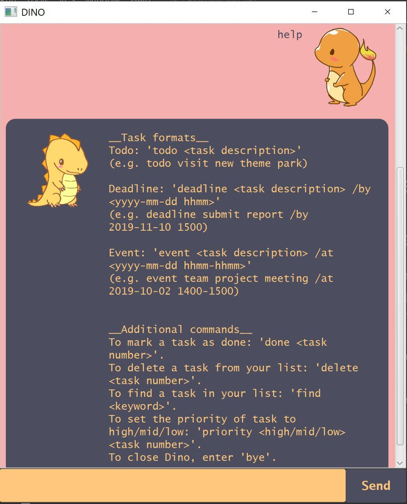
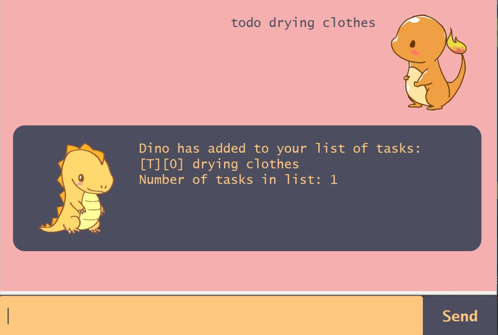
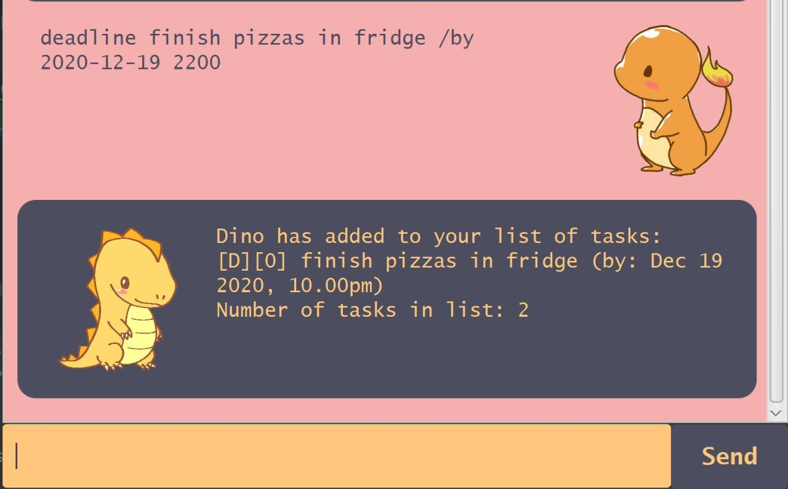
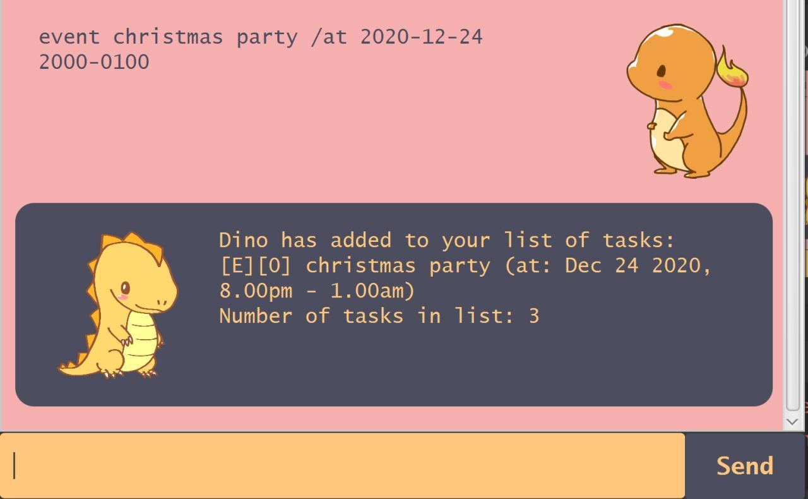
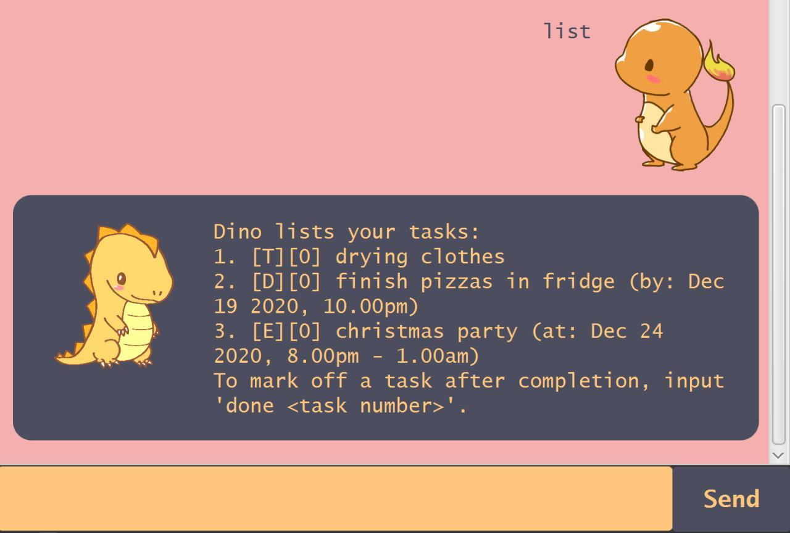
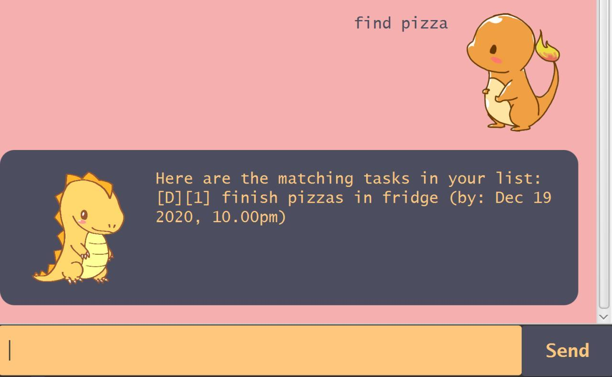
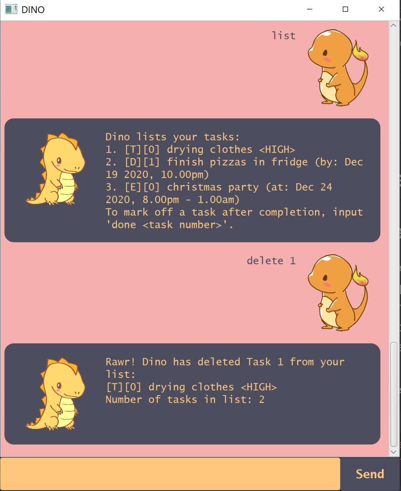
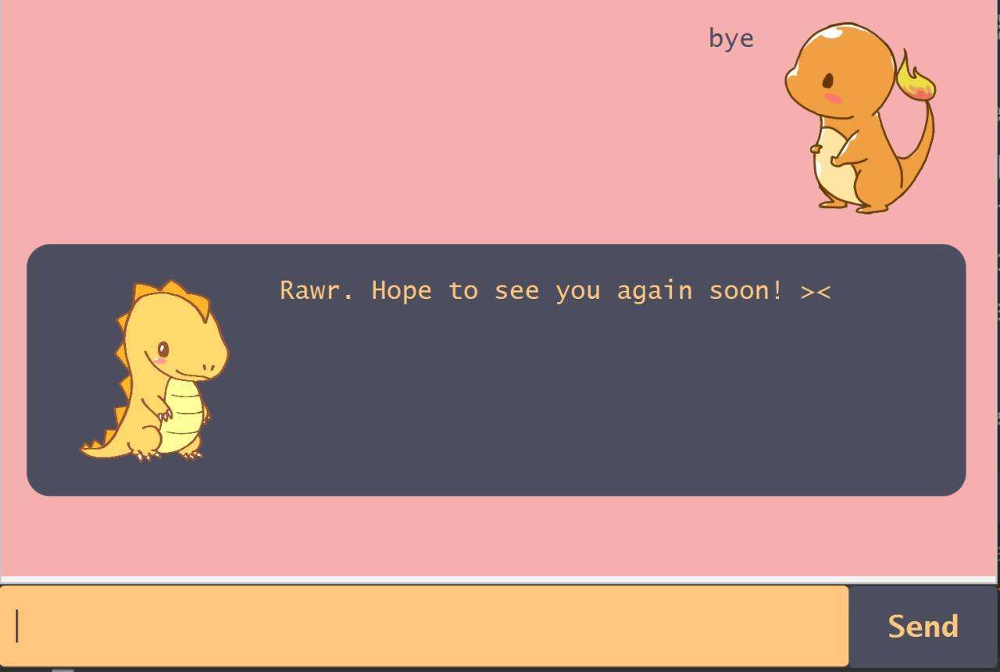

# User Guide

## Features 

### Help instructions 
The in-built help command 'help' displays a list of command formatting that teaches users
 the format to enter commands to use Dino.

## Usage

### `help` - View command formats

Type 'help' in the text box and enter to view the list of commands 
to use the features in Dino.

Example of usage: 

`help`

Expected outcome:

### Adding tasks 
Users can add three types of tasks to their task list: Todo, Deadline and Event.
Todo tasks are added with command 'todo' along with task desription.
Deadline tasks are added with command 'deadline' along with task description and task deadline.
Event tasks are added with command 'event' along with task description and task period.

## Usage

### `todo` - Add a Todo task

Type 'todo *description*', where *description* represents the task description, 
in the text box and press enter.
This will add a todo task *description* into your list of tasks.

Example of usage: 

`todo drying clothes`

Expected outcome:

### `deadline` - Add a Deadline task

Type 'deadline *description* /by *yyyy-mm-dd* *hhmm*', where *description* represents the task description,
*yyyy-mm-dd* and *hhmm* (in 24 hour format) represent the date and time of the deadline.
This will add the deadline task *description* to your task list.

Example of usage: 

`deadline finish pizzas in fridge /by 2020-12-19 2200`

Expected outcome:

### `event` - Add an Event task

Type 'event *description* /at *yyyy-mm-dd* *hhmm-hhmm*', where *description* represents the task description,
*yyyy-mm-dd* and *hhmm-hhmm* (in 24 hour format) represent the date and period (start time to end time) of the event.
This will add the event task *description* to your task list.

Example of usage: 

`event christmas party /at 2020-12-24 2000-0100`

Expected outcome:

### Display your task list
Users can view their task list by entering the command 'list' which
will display their entire task list.

## Usage

### `list` - Display task list

Type 'list' into the text box and press enter. 
 This will display the tasks in your task list.
 
Example of usage: 

`list`

Expected outcome:

### Mark completion of tasks
Users can mark their tasks as done to denote completion of the tasks.
Tasks that are not done are denoted 0 by default.
Tasks that have been marked done are denoted 1.

## Usage

### `done` - Mark task as done

Type 'done *task number*', where *task number* represents the index number of the
 task which can be viewed in the task list. 
 This will mark the task indexed by *task number* as done.
 
Example of usage: 

`done 2`

Expected outcome:

### Find a task in your task list
Users can find a task in their task list by entering a keyword representing the task description.
All tasks whose task description contains the keyword will be displayed to user.

## Usage

### `find` - Find a task

Type 'find *keyword*', where *keyword* will be used to search for all task descriptions
in the task list that contain the keyword.
This will display all tasks that contain the key word.
 
Example of usage: 

`find pizza`

Expected outcome:

### Add Priority to a task
Users can add priority *HIGH or MID or LOW* to a task in their task list,
by entering the priority followed by task number of the task.

## Usage

### `priority` - Add priority to task

Type 'priority *high/mid/low* *task number*', 
where *high/mid/low* represents the priority of the task.

Input *high* if you feel that the task is of high priority, *mid* for average priority,
and *low* for low priority. 
Do ensure that the priority *high/mid/low* is in lowercase as it is case-sensitive.
The *task number* represents the index number of the
 task which can be viewed in the task list.
This will add the priority specified to the task.
 
Example of usage: 

`priority high 1`

Expected outcome:

### Delete a task from your task list
Users can delete a task from their task list, by entering 'delete'
followed by the task number.

## Usage

### `delete` - Delete a task

Type 'delete *task number*', 
where the *task number* represents the index number of the 
task which can be viewed in the task list.
This will delete the specified task from your task list.
 
Example of usage: 

`delete 1`

Expected outcome:

### Exit from Dino
Users can exit from Dino by entering 'bye'.

## Usage

### `bye` - Exit command

Type 'bye' in the text box and press enter.
This will close Dino.
 
Example of usage: 

`bye`

Expected outcome:

